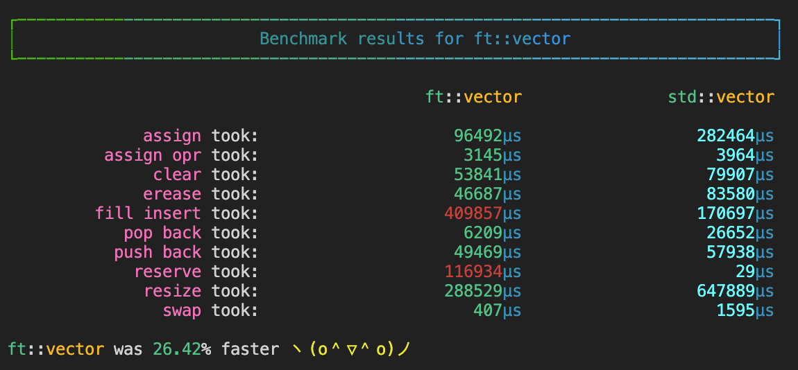
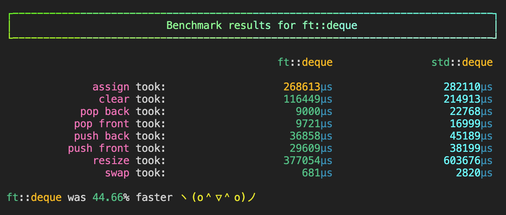
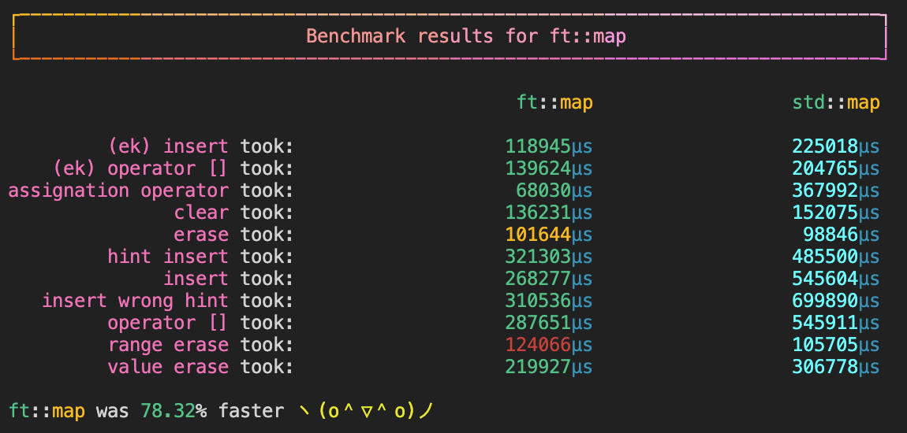
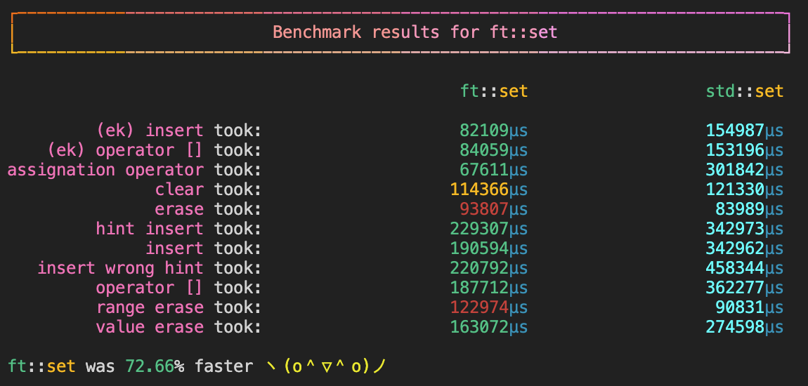

# 🗃 Containers

Reimplementing some stl containers

## 🗄️ Containers:

- [Vector](https://github.com/42-Ikole/Containers/blob/main/vector/vector.hpp)
- [Deque](https://github.com/42-Ikole/Containers/blob/main/deque/deque.hpp)
- [Stack](https://github.com/42-Ikole/Containers/blob/main/stack/stack.hpp)
- [Map](https://github.com/42-Ikole/Containers/blob/main/map/map.hpp)
- [Set](https://github.com/42-Ikole/Containers/blob/main/set/set.hpp)

## 🖇️ Features:
- Iterators
- Iterator traits
- enable_if
- Type traits

## 🪴 Implementation:
`Deque` is implemented as a [circular buffer](https://en.wikipedia.org/wiki/Circular_buffer)  
`Map` and `Set` are both implemented as a [red-black tree](https://en.wikipedia.org/wiki/Red%E2%80%93black_tree)

## 📊 Bench mark results:
I ran benchmarks on all my containers with my own tester which can be found [here](https://github.com/K1ngmar/Container-Tester)

> These benchmarks were run on macOS Monterey

### Vector:

### Deque:

### Map:

### Set:

